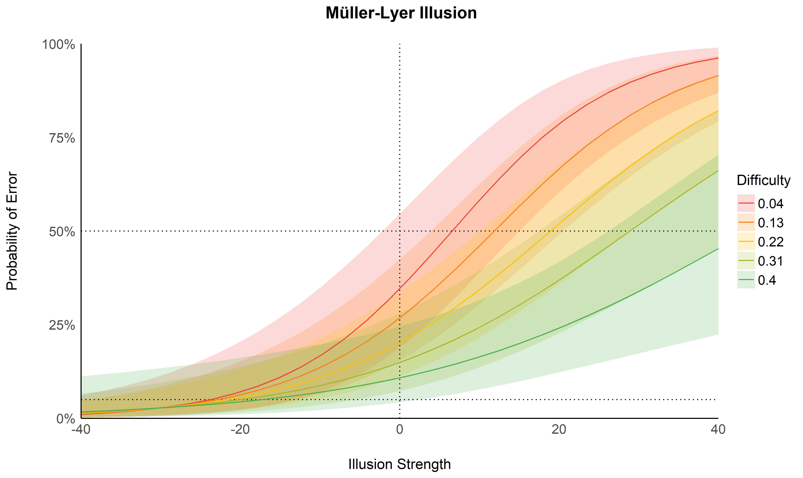
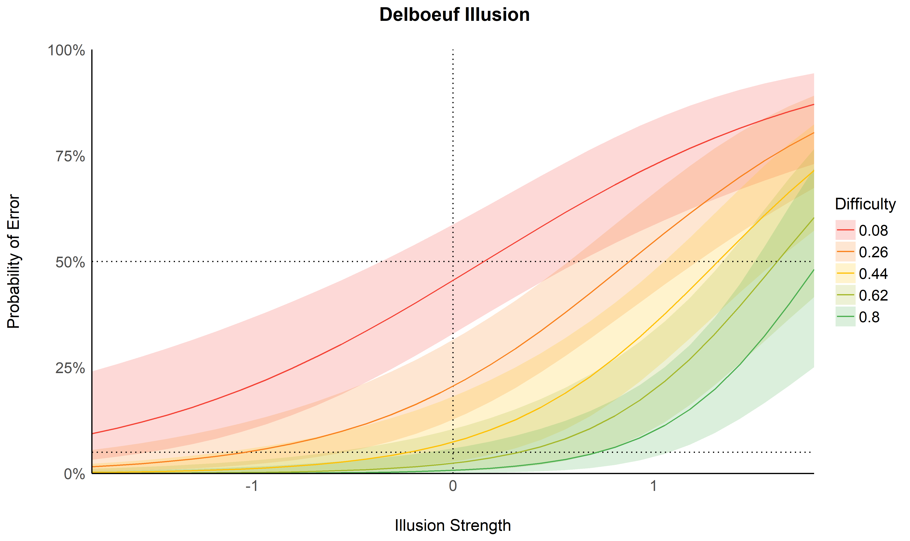
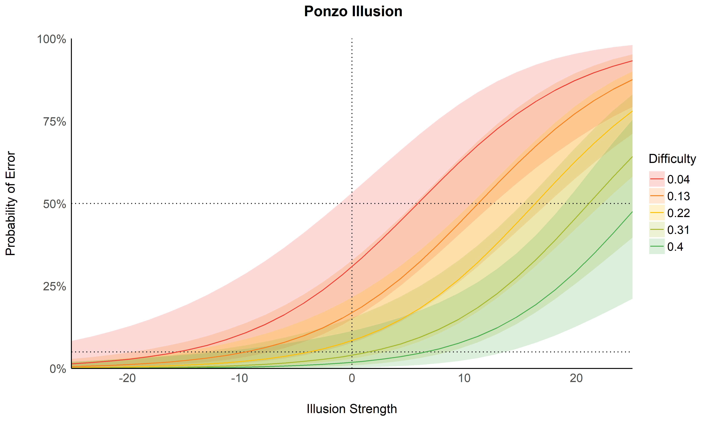
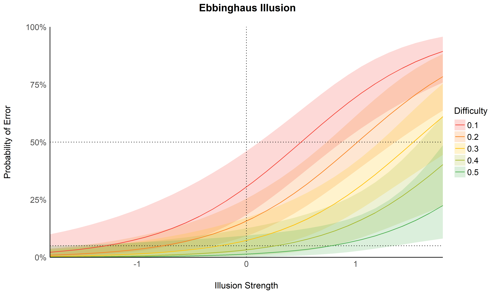
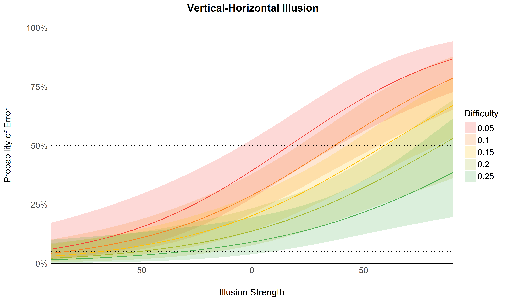
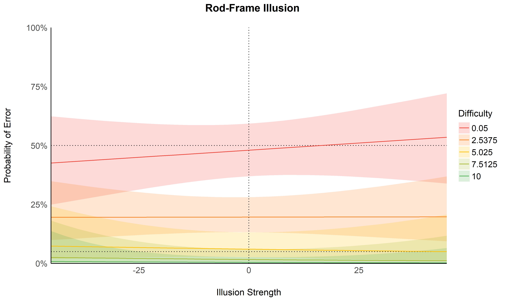
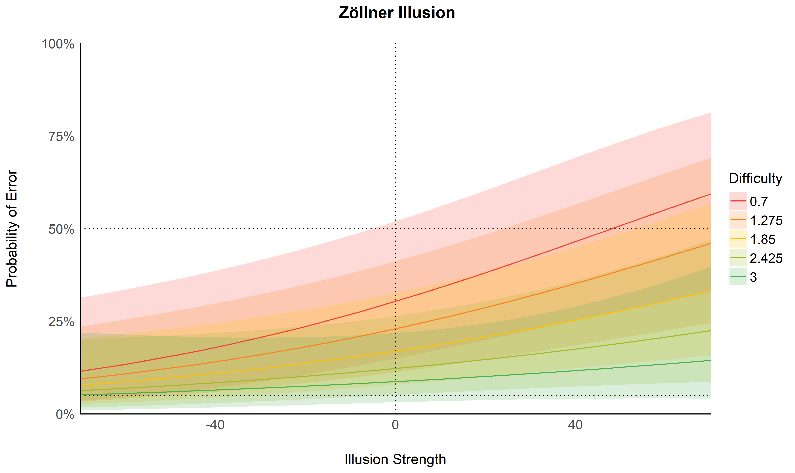
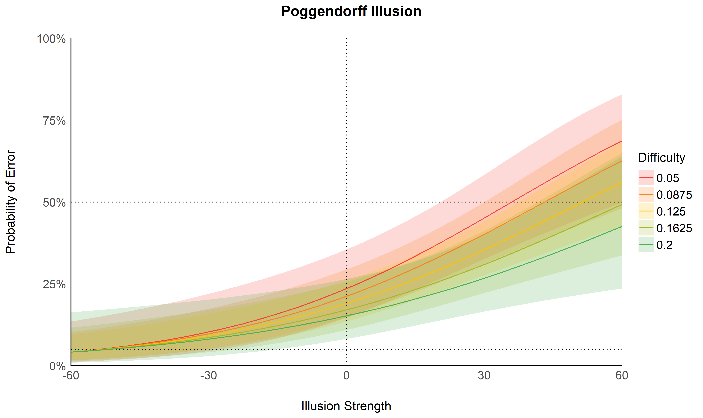
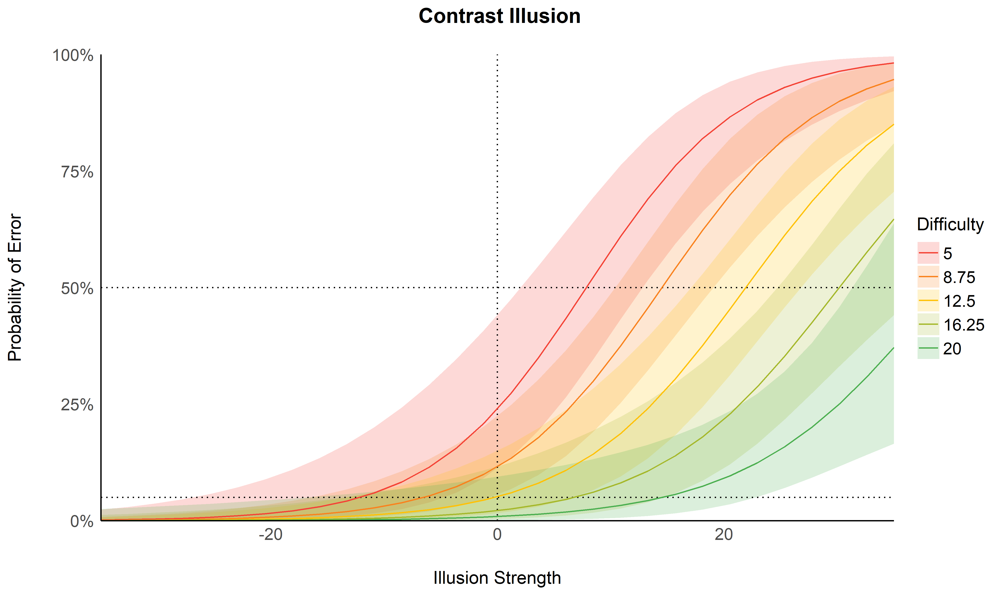
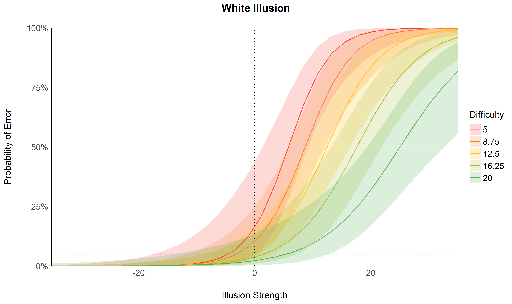

Illusion Game Open Data
================

-   [Introduction](#introduction)
-   [Methods](#methods)
    -   [Datasets](#datasets)
-   [Results](#results)
    -   [Descriptive](#descriptive)
    -   [Errors](#errors)
    -   [Drift Model](#drift-model)
-   [References](#references)

## Introduction

Behavioural findings regarding the Illusion Game.

## Methods

``` r
library(tidyverse)
library(easystats)
library(patchwork)
library(brms)
```

### Datasets

``` r
source("https://raw.githubusercontent.com/RealityBending/IllusionGame/main/preprocessing.R")

files <- list.files(path = "data/2022_07_Makowski_PilotEEG/V1", pattern = "\\.json$", full.names = TRUE)

# Loop over each file and compute function
df <- data.frame()
for (file in files) df <- rbind(df, preprocess_IllusionGame(file))
```

## Results

### Descriptive

``` r
dfsub <- df |>
  group_by(Participant) |>
  summarize(Duration = mean(Duration))
```

### Errors

``` r
model_errors <- function(df, illusion = "Delboeuf") {
  data <- df |>
    filter(Illusion_Type == illusion)

  # formula <- brms::bf(
  #   # Error ~ t2(Illusion_Difference, Illusion_Strength),
  #   Error ~ Illusion_Difference * Illusion_Strength + (1 | Participant),
  #   family = "bernoulli"
  # )
  # 
  # model <- brms::brm(formula,
  #   data = data,
  #   algorithm = "meanfield",
  #   refresh = 0
  # )
  model <- lme4::glmer(
    Error ~ Illusion_Difference * Illusion_Strength + (1 | Participant),
    data = data,
    family = "binomial"
  )
  
  n_lines <- 5
  pred <- estimate_relation(model, at = c("Illusion_Strength", "Illusion_Difference"), length = c(30, n_lines)) |>
    mutate(Illusion_Difference = as.factor(Illusion_Difference),
           Illusion_Type = illusion)

  p <- pred |>
    ggplot(aes(x = Illusion_Strength, y = Predicted, group = Illusion_Difference)) +
    geom_ribbon(aes(ymin = CI_low, ymax = CI_high, fill = Illusion_Difference), alpha = 0.2) +
    geom_vline(xintercept = 0, linetype = "dotted") +
    geom_hline(yintercept=c(0.05, 0.5), linetype="dotted") +
    geom_line(aes(color = Illusion_Difference)) +
    scale_y_continuous(limits = c(0, 1), expand = c(0, 0), labels = scales::percent) +
    scale_x_continuous(expand = c(0, 0)) +
    scale_color_manual(values = colorRampPalette(c("#F44336", "#FFC107", "#4CAF50"))(n_lines)) +
    scale_fill_manual(values = colorRampPalette(c("#F44336", "#FFC107", "#4CAF50"))(n_lines)) +
    theme_modern() +
    labs(
      title = paste0(illusion, " Illusion"),
      color = "Difficulty", fill = "Difficulty",
      y = "Probability of Error",
      x = "Illusion Strength"
    ) +
    theme(plot.title = element_text(face = "bold", hjust = 0.5))


  list(p = p, model = model, pred = pred)
}
```

``` r
rez_ponzo <- model_errors(df, illusion = "Ponzo")
rez_mullerlyer <- model_errors(df, illusion = "Müller-Lyer")

rez_delboeuf <- model_errors(df, illusion = "Delboeuf")
rez_ebbinghaus <- model_errors(df, illusion = "Ebbinghaus")
rez_contrast <- model_errors(df, illusion = "Contrast")
rez_white <- model_errors(df, illusion = "White")
rez_poggendorff <- model_errors(df, illusion = "Poggendorff")
rez_zollner <- model_errors(df, illusion = "Zöllner")
rez_rodframe <- model_errors(df, illusion = "Rod-Frame")
rez_verticalhorizontal <- model_errors(df, illusion = "Vertical-Horizontal")
```

``` r
rez_mullerlyer$p
```

<!-- -->

``` r
rez_delboeuf$p
```

<!-- -->

``` r
rez_ponzo$p
```

<!-- -->

``` r
rez_ebbinghaus$p
```

<!-- -->

``` r
rez_verticalhorizontal$p
```

<!-- -->

``` r
rez_rodframe$p
```

<!-- -->

``` r
rez_zollner$p
```

<!-- -->

``` r
rez_poggendorff$p
```

<!-- -->

``` r
rez_contrast$p
```

<!-- -->

``` r
rez_white$p
```

<!-- -->

<!-- ```{r message=FALSE, warning=FALSE} -->
<!-- rbind( -->
<!--   rez_delboeuf$pred, -->
<!--   rez_ebbinghaus$pred, -->
<!--   rez_ponzo$pred, -->
<!--   rez_mullerlyer$pred, -->
<!--   rez_contrast$pred, -->
<!--   rez_white$pred, -->
<!--   rez_poggendorff$pred, -->
<!--   rez_zollner$pred, -->
<!--   rez_rodframe$pred, -->
<!--   rez_verticalhorizontal$pred -->
<!--   ) |>  -->
<!--   ggplot(aes(x = Illusion_Strength, y = Predicted, group = Illusion_Difference)) + -->
<!--   geom_ribbon(aes(ymin = CI_low, ymax = CI_high, fill = Illusion_Difference), alpha = 0.2) + -->
<!--   # geom_vline(xintercept = 0, linetype = "dotted") + -->
<!--   geom_line(aes(color = Illusion_Difference)) + -->
<!--   scale_y_continuous(limits = c(0, 1), expand = c(0, 0), labels = scales::percent) + -->
<!--   scale_x_continuous(expand = c(0, 0)) + -->
<!--   scale_color_manual(values = colorRampPalette(c("#F44336", "#FFC107", "#4CAF50"))(5)) + -->
<!--   scale_fill_manual(values = colorRampPalette(c("#F44336", "#FFC107", "#4CAF50"))(5)) + -->
<!--   theme_modern() + -->
<!--   labs( -->
<!--     title = paste0(illusion, " Illusion"), -->
<!--     color = "Difficulty", fill = "Difficulty", -->
<!--     y = "Probability of Error", -->
<!--     x = "Illusion Strength" -->
<!--   ) + -->
<!--   theme(plot.title = element_text(face = "bold", hjust = 0.5)) + -->
<!--   facet_wrap(~Illusion_Type, scales="free") -->
<!-- ``` -->
<!-- ### RT -->
<!-- ```{r message=FALSE, warning=FALSE} -->
<!-- run_model_rt <- function(df, illusion = "Delboeuf") { -->
<!--   data <- df |> -->
<!--     filter(Illusion_Type == illusion) |>  -->
<!--     mutate(Error = ifelse(Error == 1, "Error", "Correct")) -->
<!--   model <- lme4::lmer( -->
<!--     RT ~ Error * (Illusion_Difference * Illusion_Strength) + (1 | Participant), -->
<!--     data = data -->
<!--   ) -->
<!--   pred <- estimate_relation(model, at = c("Illusion_Strength", "Illusion_Difference", "Error"), length = c(30, 5)) |> -->
<!--     mutate(Illusion_Difference = as.factor(Illusion_Difference), -->
<!--            Illusion_Type = illusion) -->
<!--   p <- pred |> -->
<!--     mutate(Predicted = ifelse(Error == "Error", -Predicted, Predicted)) |>  -->
<!--     ggplot(aes(x = Illusion_Strength, y = Predicted, group = interaction(Illusion_Difference, Error))) + -->
<!--     # geom_ribbon(aes(ymin = CI_low, ymax = CI_high, fill = Illusion_Difference), alpha = 0.2) + -->
<!--     geom_line(aes(color = Illusion_Difference)) + -->
<!--     scale_y_continuous(expand = c(0, 0)) + -->
<!--     scale_x_continuous(expand = c(0, 0)) + -->
<!--     scale_color_manual(values = colorRampPalette(c("#F44336", "#FFC107", "#4CAF50"))(5)) + -->
<!--     scale_fill_manual(values = colorRampPalette(c("#F44336", "#FFC107", "#4CAF50"))(5)) + -->
<!--     theme_modern() + -->
<!--     labs( -->
<!--       title = paste0(illusion, " Illusion"), -->
<!--       color = "Difficulty", fill = "Difficulty", -->
<!--       y = "Reaction Time", -->
<!--       x = "Illusion Strength" -->
<!--     ) + -->
<!--     theme(plot.title = element_text(face = "bold", hjust = 0.5)) -->
<!--   list(p = p, model = model, pred = pred) -->
<!-- } -->
<!-- ``` -->
<!-- ```{r message=FALSE, warning=FALSE} -->
<!-- run_model_rt(df, illusion = "Delboeuf")$p -->
<!-- run_model_rt(df, illusion = "Ebbinghaus")$p -->
<!-- run_model_rt(df, illusion = "Ponzo")$p -->
<!-- run_model_rt(df, illusion = "Müller-Lyer")$p -->
<!-- run_model_rt(df, illusion = "Contrast")$p -->
<!-- run_model_rt(df, illusion = "White")$p -->
<!-- run_model_rt(df, illusion = "Poggendorff")$p -->
<!-- run_model_rt(df, illusion = "Zöllner")$p -->
<!-- run_model_rt(df, illusion = "Rod-Frame")$p -->
<!-- run_model_rt(df, illusion = "Vertical-Horizontal")$p -->
<!-- ``` -->

### Drift Model

## References
